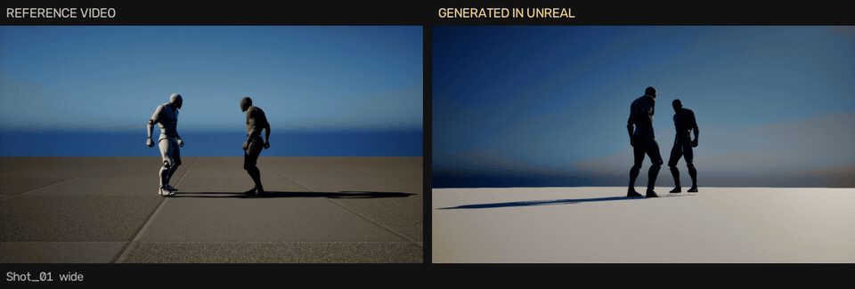
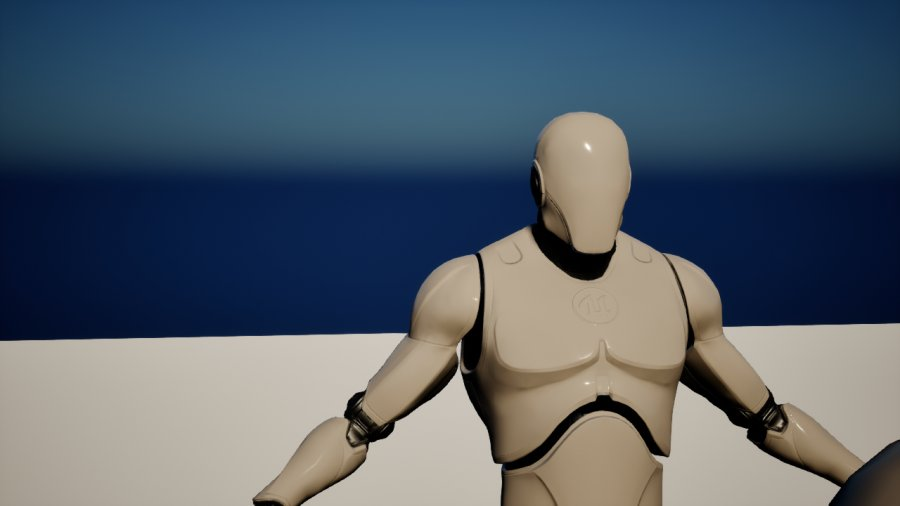
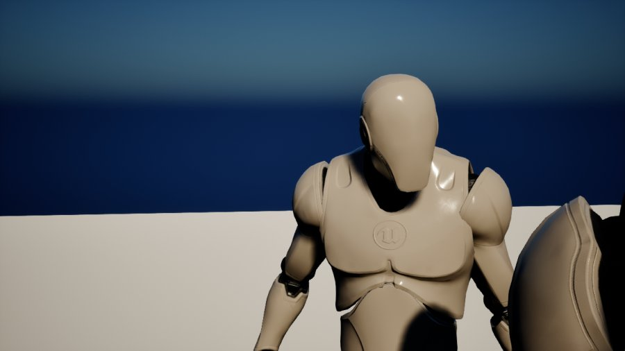
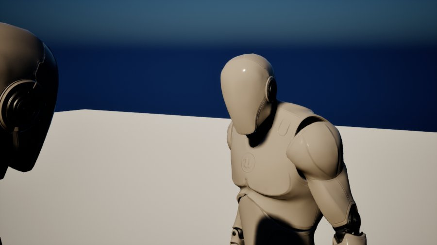
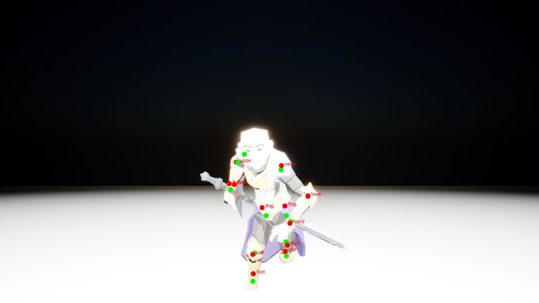
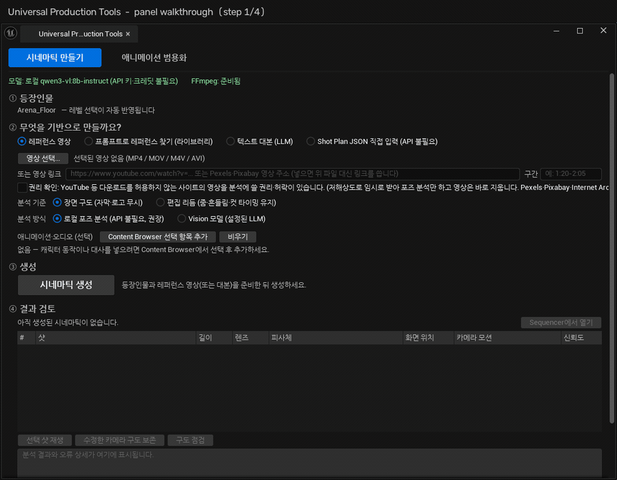
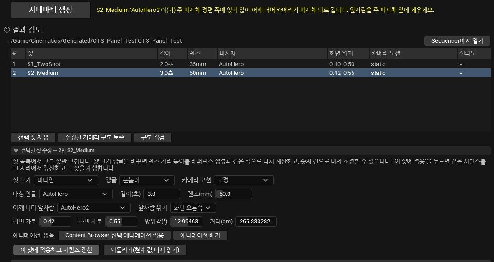
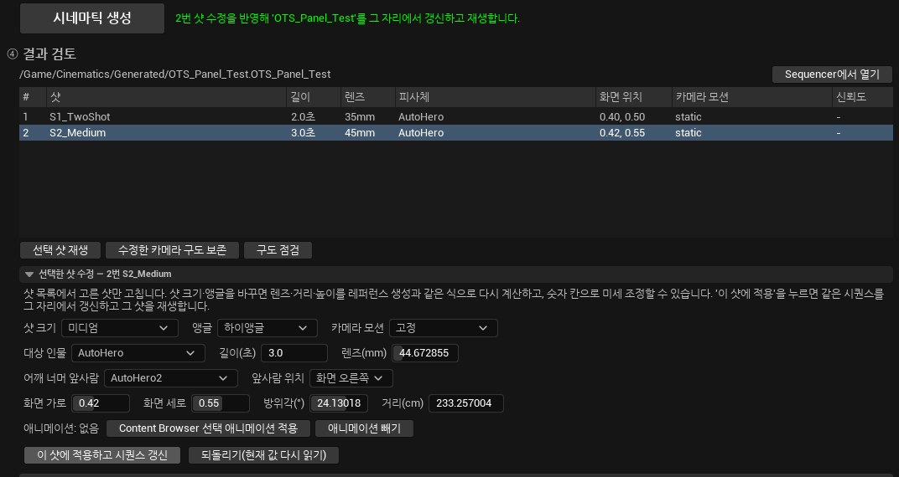
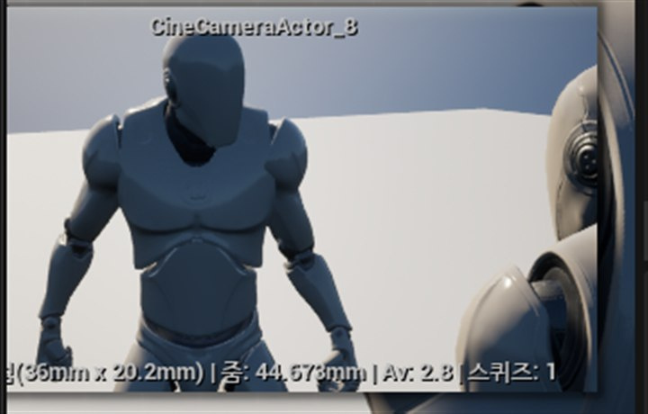
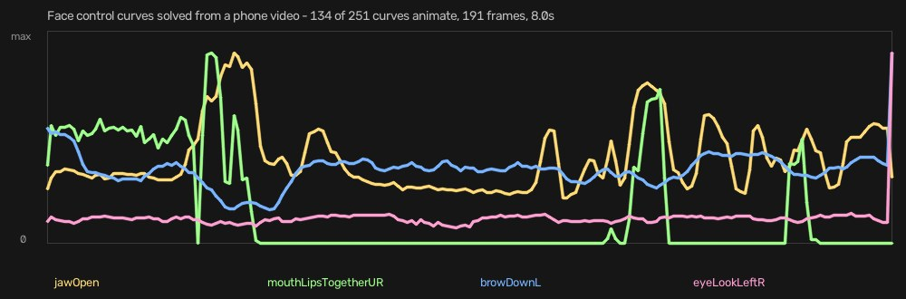

# Universal Production Tools

레퍼런스 영상의 **카메라 구도를 언리얼 시퀀스로 재현하고**, **캐릭터 애니메이션을 자동으로 옮기는**
에디터 플러그인입니다. (UE 5.7)

영상을 넣으면 샷을 나누고, 각 샷의 인물 위치·크기·앵글을 읽어, 레벨에 있는 캐릭터로 같은 구도의
Level Sequence를 만듭니다. LLM 없이 로컬 포즈 분석(YOLOX + RTMPose)만으로 동작합니다.

[English](README.en.md) · [한 장 요약](Docs/PORTFOLIO.md)



*왼쪽이 레퍼런스 클립, 오른쪽이 같은 구도로 생성된 언리얼 시퀀스. 샷 분할·인물 크기·카메라 앵글·어깨 너머
배치가 함께 재현됩니다. (레퍼런스는 평가용으로 만든 5샷 테스트 클립입니다)*

## 이런 걸 잡습니다

어깨 너머(OTS) 샷. 솔버는 **두 경우 모두 "성공"이라고 보고**했지만, 왼쪽은 앞사람이 프레임 아래로
빠져 있었습니다. 가로 위치만 검사하고 세로는 전혀 보지 않았기 때문입니다.

| 수정 전 — 우하단 구석에 덩어리만 | 수정 후 — 어깨가 오른쪽 가장자리에 걸림 |
|---|---|
|  |  |

같은 코드로 반대쪽을 지정한 결과. 앞사람의 머리·어깨가 왼쪽에 걸리고 주 피사체 얼굴은 가려지지 않습니다.



이 문제를 사람 눈이 아니라 자동으로 잡기 위해, 생성된 샷을 다시 촬영해 측정합니다.
초록 X는 레퍼런스가 요구한 위치, 빨강 +는 실제로 측정된 위치입니다.


## 무엇이 다른가 — 눈이 아니라 숫자로 검증합니다

이 저장소의 핵심은 기능 목록이 아니라 **정확도를 재는 장치**입니다.

생성된 시퀀스를 같은 포즈 분석기로 다시 촬영·측정해 레퍼런스와 비교하고, 그 수치를 회귀 검사로 잠급니다.
엔진 안에서 카메라와 뼈 위치를 알고 있으므로 "정답"을 직접 만들 수 있다는 점을 활용했습니다.

```
Tools/eval/
  editor/upt_capture_*.py   에디터에서 정답 데이터 촬영 (뼈 위치·화면 투영값을 기록)
  eval_*.py                 정답 대비 오차 측정
  run_regression.py         전체 스위트 실행 + baseline.json 기준 비교
```

현재 **12개 스위트**가 돌아갑니다. 예시:

| 스위트 | 무엇을 지키는가 | 현재 값 |
|---|---|---|
| `framing_video` | 샷 분할·인물 위치 오차 | 가로 오차 ≤ 0.02 |
| `twoshot_video` | 두 인물 배치·어깨 너머 판정 | 오검출 0 |
| `letterbox_video` | 레터박스·자막이 있는 세로 영상 | 20샷 검출 |
| `body_pose` | 영상 관절 ↔ 실제 뼈 오차 | 화면 오차 2.7% |
| `body_height` | 전신 키 추정 오차 (세 체형 378프레임) | 중앙 10.1% |
| `retarget` | 리타기팅이 동작을 보존했는가 | 뼈마디 각도 3.7° |

## 이 접근으로 실제로 잡은 것들

측정 장치가 없었으면 그냥 넘어갔을 문제들입니다. 자세한 기록은 [Docs](Docs)에 있습니다.

- **어깨 너머(OTS) 샷이 가로만 맞고 세로로 프레임을 벗어났다** — 솔버가 "성공"이라고 보고하는데도
  실제 화면엔 앞사람이 없었습니다. 가로 위치만 검사하고 세로는 전혀 보지 않았기 때문입니다.
  → [OTS_FRAMING_FIX.md](Docs/OTS_FRAMING_FIX.md)
- **검증기가 잘린 인물의 위치를 9%나 틀리게 쟀다** — 프레임에 잘린 몸의 축을 연장해 조준점을 잡으면
  기울어 선 인물에서 옆으로 밀립니다. 세 가지 측정 규칙을 정답에 대고 채점해 가장 나은 것을 골랐습니다.
- **어깨 너머 자동 검증이 원리적으로 불가능했다** — 인물 검출기도 분할 모델도 카메라에 아주 가까운
  마네킹 어깨를 사람으로 보지 못합니다(둘 다 0개 검출). 앞사람만 숨기고 한 장 더 찍어 차이를 보는
  방식으로 바꾸니 모델 없이 정확히 판정됩니다.
- **영상에서 뽑은 3D 관절의 깊이는 쓸 수 없었다** — 깊이 상관 0.215, 오른손은 −0.35(반대로 움직임),
  양발은 0.0. 어느 발이 앞인지도 구분 못 합니다. 그래서 **애니메이션 굽기는 중단했습니다.**
  → [BODY_MOTION_FROM_VIDEO.md](Docs/BODY_MOTION_FROM_VIDEO.md)

  아래는 영상에서 추정한 관절(빨강)과 엔진이 아는 실제 뼈 위치(초록)를 겹친 것입니다.
  2D는 몸 높이 대비 7.2%로 쓸 만하지만, 깊이는 잡음이었습니다.

  

측정 없이 고쳤다가 되돌린 것도 기록해 두었습니다. 크기 점수를 "정확한 기하값"으로 바꿨더니 오히려
나빠졌고(레퍼런스 쪽도 같은 추정기로 재기 때문), 체형 보정 한계를 넓힌 개선폭은 재촬영에서 재현되지
않았습니다. → [BODY_HEIGHT_ESTIMATOR.md](Docs/BODY_HEIGHT_ESTIMATOR.md)


## 패널은 실제로 이렇게 돌아갑니다

콘솔 명령으로 파이프라인을 검증하는 것과 별개로, **에디터 패널을 직접 조작해 흐름을 확인**했습니다.
아래는 그 과정입니다(레벨 선택 반영 → JSON 입력 → 생성 → 샷 수정).



확인된 것:

- 레벨에서 Actor를 고르면 **① 등장인물이 즉시 갱신**됩니다.
- `Shot Plan JSON 직접 입력` 모드는 영상·API 없이 동작합니다. 3샷 플랜을 붙여넣고 생성하니
  `/Game/Cinematics/Generated/Panel_Test`가 만들어지고 샷 목록에 렌즈(28·50·85mm)와
  화면 위치가 그대로 표시됐습니다.
- 샷을 고르면 **선택한 샷 수정**이 열리고, 샷 크기·앵글·렌즈·길이와 함께
  **어깨 너머 앞사람·앞사람 위치** 콤보가 나옵니다.

같이 찾은 작은 문제: **어깨 너머 앞사람 목록에 그 샷의 주 피사체 자신이 들어 있습니다.**
고르면 솔버가 "앞사람은 주 피사체와 다른 Actor여야 합니다"로 거부하므로 동작은 안전하지만,
UI가 처음부터 제외하는 편이 낫습니다.

### 어깨 너머 샷 수정을 패널에서 끝까지 돌려봤습니다

앞사람을 지정하고 **이 샷에 적용하고 시퀀스 갱신**을 누르는 경로를, 배치를 바꿔 가며 두 번 확인했습니다.

**① 앞사람이 주 피사체 앞에 없을 때 — 적용을 거부합니다**



`AutoHero2`가 주 피사체 옆에 서 있는 상태로 적용하면 시퀀스를 건드리지 않고 경고만 냅니다.
카메라가 피사체 뒤로 도는 구도를 조용히 만들어 내는 대신 멈추는 쪽을 택했습니다.
샷 목록의 렌즈는 50mm 그대로, 방위각 12.99°도 그대로입니다.

**② 앞사람을 피사체 앞으로 옮기면 — 같은 시퀀스를 그 자리에서 갱신합니다**



`AutoHero2`를 주 피사체 정면으로 옮기고 다시 적용하니 통과했고, **렌즈 50 → 44.67mm,
방위각 12.99 → 24.13°, 거리 266.8 → 233.3cm**로 다시 계산됐습니다. 어깨 너머 구도를 만들려고
카메라 높이를 다시 잡으면서 앵글 표시도 눈높이 → 하이앵글로 바뀌었습니다.
**새 에셋이 생기지 않고 샷 수도 2개 그대로** — 같은 시퀀스를 제자리에서 고칩니다.

실제 카메라 프리뷰:



*주 피사체가 왼쪽, 앞사람의 어깨가 오른쪽 가장자리를 채웁니다.*

여기서 하나 더 나왔습니다. **구도 점검**은 이 샷을
`LOW 15/100 | 전신 세로 점유 170%, 머리 끝 y=0.02 / 헤드룸 부족`으로 표시합니다.
어깨 너머 미디엄 샷이라 전신이 잘리는 것이 의도된 구도인데도 점수가 낮게 나옵니다 —
**점검기가 샷 크기를 고려하지 않는다**는 뜻이고, 다음 수정 항목으로 남겨 뒀습니다.

## 캐릭터 애니메이션 파이프라인

구도 재현과 별개로, **애니메이션을 캐릭터 사이로 옮기고 영상에서 만들어 내는** 쪽도 구현돼 있습니다.
C++ 약 1,100줄 + 에디터 파이썬 스크립트입니다.

**1. 스켈레톤 자동 분석** — `UPTSkeletonAnalyzer` (395줄)
본 이름·계층·레퍼런스 포즈의 공간 위치를 함께 써서 휴머노이드 역할(골반·척추·양팔·양다리)을 추론하고,
항목별 신뢰도와 A/B/C 준비도 등급을 냅니다. Twist·손가락·얼굴 보조 본은 따로 분류해 핵심 판정에서 뺍니다.
`L-Forearm`, `RigLArm1` 같은 비표준 명칭도 역할로 인식합니다.

**2. IK Rig · IK Retargeter 자동 생성** — `UPTIKRigBuilder` (214줄), `UPTIKRetargeterBuilder` (124줄)
엔진의 Auto Characterizer(`IKRigAutoCharacterizer`)를 1순위로 쓰고, 엔진 템플릿에 없는 구조는 위의 자체
분석으로 대체합니다. 체인 생성, 손·발 Full Body IK Goal, 팔꿈치·무릎 관절 제한 프리셋까지 만듭니다.

**3. 애니메이션 일괄 리타기팅** — `SUPTAnimationRetargetWindow` (317줄)
콘텐츠 브라우저에서 대상 메시를 우클릭 → 애니메이션을 여러 개 골라 한 번에 변환합니다.
Source 스켈레톤별로 Profile·IK Rig·Retargeter를 알아서 준비하고, 상체/하체 모드는 슬롯 Montage까지 만듭니다.
**준비도 70% 미만이면 자동 변환을 중단하고 수동 검수로 돌립니다** — 조용히 망가진 결과를 내놓지 않습니다.

**4. 영상 한 대로 얼굴 애니메이션** — UE 5.8 MetaHuman Animator → 5.7 이식
휴대폰으로 찍은 영상(Mono footage, Identity 없이)으로 얼굴 컨트롤 커브를 풀어 냅니다.
FBX 임포트가 5.7에서 애니메이션을 만들어 주지 않아, **커브 값만 옮겨 5.7에서 AnimSequence를 새로 구웠습니다**
(`Tools/editor/build_face_anim_57.py`).



*251개 컨트롤 중 134개가 실제로 움직입니다. 191프레임, 23.976fps, 8.0초.*

막힌 부분도 여기에 적습니다. **몸 동작은 중단했습니다** — 위의 깊이 문제 때문입니다.
`MetaHumanBodyTracker` 플러그인을 구하면 5.8 경로가 정공법입니다.
5.8 작업에서 걸린 함정들(프레임 파일명 규칙, `metadata.frame_rate`, 비동기 파이프라인, 엔진 내장
익스포터의 하드코딩 경로)은 [METAHUMAN_CAPTURE_5_8.md](Docs/METAHUMAN_CAPTURE_5_8.md)에 정리했습니다.


### 애니메이션 쪽도 측정으로 검증했습니다

기능만 있고 측정이 없으면 "잘 된다"는 주장일 뿐입니다. 두 가지를 숫자로 확인했습니다.

**자산 1,691개로 스켈레톤 분석기 검증** — 자동 리타기팅은 준비도 70% 미만이면 중단하는데,
그 게이트가 실제 자산에서 맞는지 확인한 적이 없었습니다. 콘솔 명령(`UPT.SkeletonAudit`)으로
프로젝트의 Skeletal Mesh 전부를 21초에 분석했습니다.

C등급 196개는 대부분 2본짜리 큐브·카메라 리그·차량 템플릿·거미·용 — **막혀야 할 것들이 맞게 막혀** 있었습니다.
그런데 **통과한 A등급 중 7개에 엉터리 매핑이 섞여** 있었습니다. Mixamo 계열 `X_Bot`은
**왼쪽 다리만 한 칸씩 밀렸는데**(LeftThigh←LeftLeg) 오른쪽은 정확해서 **준비도 100%로 통과**했습니다.
역할을 하나씩 독립적으로 고르고 역할 사이의 관계를 확인하지 않는 구조 때문이었습니다.

→ 배정 후 **체인 정합성 검사**를 추가했습니다(부모 역할의 자손인가 / 좌우 짝이 같은 깊이인가).
1,691개 중 **정확히 3개만** 등급이 바뀌었고(전부 실제로 밀린 것), 오탐은 0입니다.
한 번은 과하게 잡아 Sidekick 10개를 오탐으로 내렸다가, 이름 근거가 확실하면 리그 비대칭을
자산 특성으로 넘기는 예외를 넣어 되돌렸습니다. → [SKELETON_AUDIT.md](Docs/SKELETON_AUDIT.md)

**리타기팅 품질 측정** — 체형이 다르면 관절 위치는 비교할 수 없으므로 **뼈마디 방향**과 **발 미끄러짐**을 잽니다.
첫 측정에서 다리는 2.2°인데 **팔만 52.9° 어긋났고**, 24표본 전부에서 각도가 **표준편차 0.0으로 일정**했습니다.
동작은 정확히 옮겨졌고 레스트 포즈(A/T 포즈) 보정이 빠진 것이었습니다.
빌더가 `AutoAlignAllBones`의 어설션 위험 때문에 자세 정렬을 통째로 건너뛰고 있었는데,
그 비용이 얼마인지는 아무도 재지 않았습니다.

→ 매핑된 **체인의 본만** 정렬하도록 고쳐 **각도 중앙 7.8° → 3.7°, 최악 58.4° → 10.4°, 팔 52.9° → 0.1°**.
발 미끄러짐은 원본 0.0995 대비 0.1049로 거의 같아, 리타기팅이 미끄러짐을 더 만들지 않았습니다.
→ [RETARGET_QUALITY.md](Docs/RETARGET_QUALITY.md)

## 구성

```
Source/UniversalProductionTools/   C++ (Slate 패널, 구도 솔버, 시퀀스 생성, 자동화 테스트)
Tools/                             파이썬 분석기 (포즈 분석, 링크 다운로드, 라이브러리 검색, 검증)
Tools/eval/                        정답 촬영 + 오차 측정 + 회귀 검사
Tools/editor/                      5.7 에디터 유틸 (5.8 얼굴 커브 → AnimSequence 굽기)
Docs/                              작업 기록 (CH5_Project/Docs 사본)
MetaHumanCapture58/Scripts/        UE 5.8 MetaHuman 얼굴 캡처 스크립트
```

## 설치

### 1. 플러그인

프로젝트의 `Plugins/` 아래에 두고 에디터를 빌드합니다.

```bash
"C:/Program Files/Epic Games/UE_5.7/Engine/Build/BatchFiles/Build.bat" \
  <프로젝트>Editor Win64 Development -Project="<경로>/<프로젝트>.uproject" -WaitMutex
```

### 2. 분석기 환경

```powershell
Tools\setup_analyzer_env.ps1
```

`ThirdParty/UPTAnalyzer/.venv`에 파이썬 환경을 만들고 `requirements-pose-analyzer.txt`를 설치합니다.
포즈 모델(ONNX)은 첫 실행 때 자동으로 내려받습니다(저장소에는 포함하지 않습니다).

### 3. 확인

```bash
cd Tools/eval
../../../../ThirdParty/UPTAnalyzer/.venv/Scripts/python.exe run_regression.py
```

정답 데이터(`Saved/UniversalProductionTools/GroundTruth/`)가 없는 스위트는 건너뜁니다.
정답은 `Tools/eval/editor/upt_capture_*.py`를 에디터에서 실행해 만듭니다.

## 쓰는 법

에디터에서 `Window > Universal Production Tools`를 엽니다.

1. 레퍼런스 영상 파일을 고르거나 링크를 붙여넣습니다(구간 지정 가능).
2. 레벨에서 등장인물 Actor를 선택해 가져옵니다.
3. 분석 → 역할 매핑 확인 → Level Sequence 생성.
4. 생성 후 샷 목록에서 개별 샷의 크기·앵글·어깨 너머를 고쳐 같은 시퀀스에 다시 적용합니다.

패널 없이 같은 파이프라인을 돌리는 콘솔 명령도 있습니다.

```
UPT.ReferenceE2E "<reference_plan.json>" <ActorLabel...> [-editshot=N] [-link=URL -section=A-B -rights]
```

기능 전체 목록과 LLM 경로, 스켈레톤 분석·리타기팅 기능은 [PLUGIN_FEATURES.md](Docs/PLUGIN_FEATURES.md)를 보세요.

## 알려진 한계

- **얼굴 없는 마네킹**으로는 클로즈업 구도 점수가 낮게 나옵니다. 실사 인물의 익스트림 클로즈업을
  재현하는 것은 원리상 불가능합니다(20샷 쇼츠 세트에서 종합 23점).
- **흰 마네킹의 얼굴 근접**은 인물 검출 자체가 실패합니다(126프레임 중 30프레임).
- **몸 동작 추출은 중단** 상태입니다. 위 깊이 문제 때문입니다. MetaHumanBodyTracker 플러그인을
  구하면 5.8 경로가 정공법입니다.
- 정답 데이터는 캐릭터 2종(갑옷 캐릭터, 표준 마네킹)뿐입니다. 체형이 더 다양해지면 보정 상수를
  다시 확인해야 합니다.

## 라이선스

개인 프로젝트입니다. 별도 라이선스를 명시하기 전까지 모든 권리는 저자에게 있습니다.
